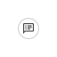
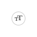
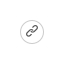

| no  |    種別    |             項目             |                  アイコン                  |         ファイル名         |
| --- | ---------- | ---------------------------- | ------------------------------------------ | -------------------------- |
| 1   | メッセージ | 文字                         |           | icon-usertext.svg          |
| 2   | メッセージ | 画像                         |            | icon-picture.svg           |
| 3   | メッセージ | イメージマップ               |           | icon-imagemap.svg          |
| 4   | メッセージ | 確認型テンプレート           |   | icon-template_button.svg   |
| 5   | メッセージ | ボタン型テンプレート         |    | icon-template_button.svg   |
| 6   | メッセージ | カルーセル型テンプレート     |  | icon-template_carousel.svg |
| 7   | メッセージ | 画像カルーセル型テンプレート |  | icon-template_carousel.svg |
| 8   | メッセージ | 動画                         |              | icon-movie.svg             |
| 9   | メッセージ | 音声                         |              | icon-voice.svg             |
| 10  | メッセージ | ファイル                     |               | icon-file.svg              |
| 11  | メッセージ | スタンプ                     |              | icon-stamp.svg             |
| 12  | メッセージ | (フレックスバブル)           |                                            |                            |
| 13  | メッセージ | (フレックスカルーセル)       |                                            |                            |
| 14  | メッセージ | (クイックリプライ)           |                                            |                            |
| 15  | アクション | メッセージ                   |               | icon-text.svg              |
| 16  | アクション | URL                          |                | icon-url.svg               |
| 17  | アクション | ポストバック                 |                                            |                            |
| 18  | アクション | 位置情報                     |                | icon-map.svg               |
| 19  | アクション | 日時選択                     |                                            |                            |
| 20  | -          | 未選択                       |               | icon-none.svg              |
| 21  | (参考)     |                              |                    | text.svg                   |

